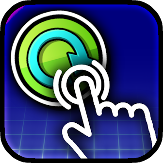
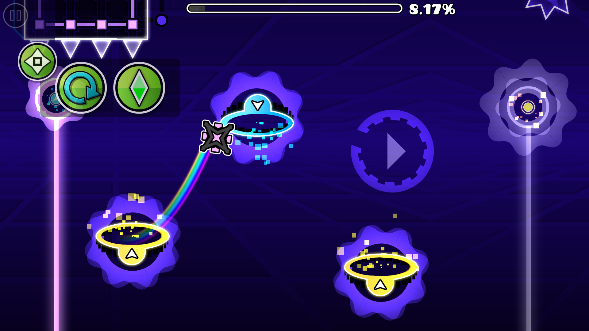
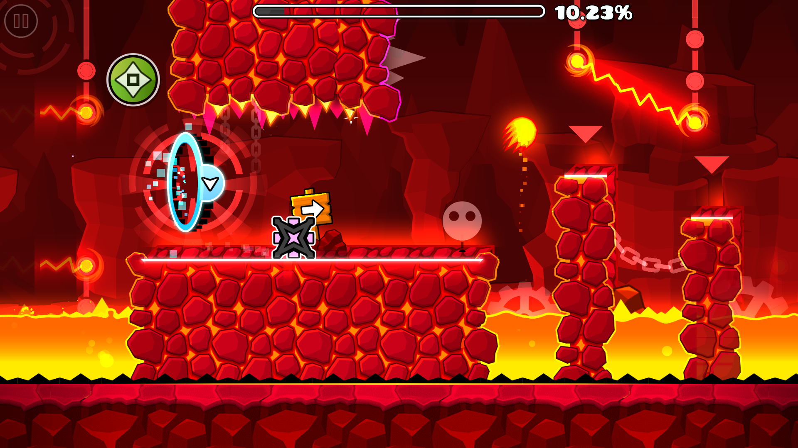
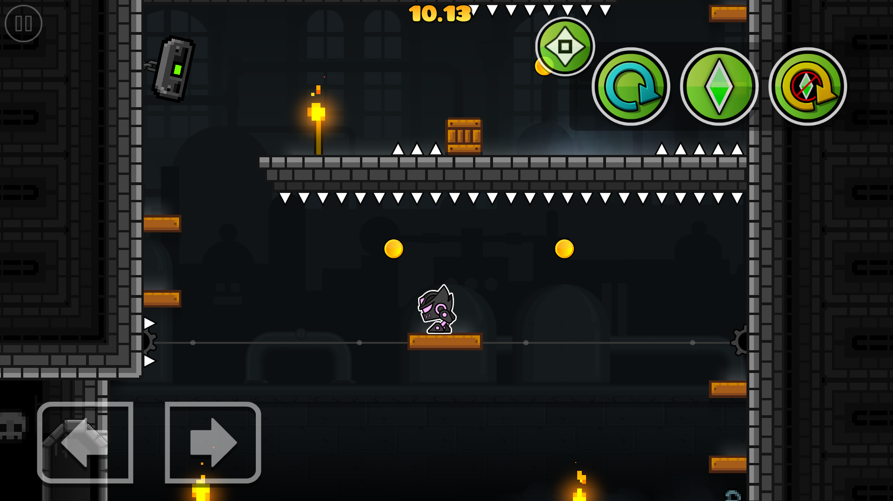

#  Quick Gameplay Actions
Mobile-friendly UI for quick in-game actions.

---

>   

>  
>  
> 

> [!TIP]
> *This mod has settings you can utilize to customize your experience.*

---

## About
This mod adds a menu in the level UI to work with your gameplay more quickly!

---

### Menu
A menu will appear in-game, it'll have your essentials such as practice mode and restart level. Since the intention is for the player to do stuff quicker, these buttons will have no confirmation pop-up and will immediately function as intended.

Drag the top-left button to position the menu wherever on the screen you would like it to be. You may also press said button without moving it to toggle the menu when you need it out of the way.

You can change which buttons you want to actually use on this menu in the mod's settings.

---

---

### Changelog
###### What's new?!
**[📜 View the latest updates and patches](./changelog.md)**

### Issues
###### What's wrong?!
**[⚠️ Report a problem with the mod](../../issues/)**